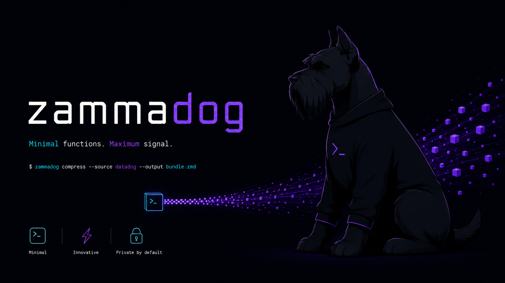

<p align="center">
  
</p>

# zammadog

Token-friendly Datadog Logs/APM CLI for AI agents and humans.

Fetches logs and spans, compacts them aggressively (~150 B per event), and outputs column-aligned tables.

**Datadog**: stdlib-only HTTP client.  
**CloudWatch**: requires `boto3>=1.34` (reads AWS default credential/region chain).

## Claude Code skill

Skill `zammadog` lives at `skills/zammadog/` in repo root. Symlink or copy to `~/.claude/skills/` to enable. Auto-triggers when investigating prod incidents, parsing Datadog URLs, or fetching evidence from logs/APM.

## Install

```bash
# Local dev (from repo root)
pip install -e .

# Alongside global-backend-agent
pip install -e ../zammadog-cli
```

## Auth

```bash
export DD_API_KEY=...
export DD_APP_KEY=...
export DD_SITE=datadoghq.com   # or datadoghq.eu
```

## CLI usage

### From a Datadog URL

```bash
zammadog from-url "https://app.datadoghq.com/logs?query=service%3Ams-foo+status%3Aerror&from_ts=now-1h&to_ts=now"
```

Parses the URL, classifies it, fetches aggregate + samples, prints a compact evidence block.

### Logs

```bash
zammadog logs search --query "service:ms-foo status:error" --from now-30m --limit 25
zammadog logs aggregate --query "status:error" --group-by "service,status" --from now-1h
# Non-default aggregation (default is "count")
zammadog logs aggregate --query "service:ms-foo" --group-by "service" --compute "avg:@duration"
```

Aggregations return up to 20 buckets per facet (top-N by the chosen `--compute`).

### APM

```bash
zammadog apm search --query "service:ms-foo" --from now-30m --limit 25
zammadog apm search --query "trace_id:abc123def456" --from now-1h --limit 50
zammadog apm aggregate --query "status:error" --group-by "service,resource" --from now-1h

# Full trace analysis — fetches all pages automatically (up to 500 spans)
zammadog apm trace <trace_id> --from now-24h           # grouped count summary
zammadog apm trace <trace_id> --from now-24h --stats   # + min/max/avg duration per group
zammadog apm trace <trace_id> --from now-24h --json    # raw JSON

# Endpoint report — cross-trace internal call analysis
zammadog apm endpoint-report "POST /my-svc/v1/foo" --service my-svc --from now-24h --sample 10
zammadog apm endpoint-report "POST /my-svc/v1/foo" --service my-svc --from now-24h --sample 10 --html --out report.html
zammadog apm endpoint-report "POST /my-svc/v1/foo" --service my-svc --from now-24h --sample 10 --ai
```

### CloudWatch

Uses the boto3 default credential and region chain (`aws configure`, `AWS_REGION`, `AWS_PROFILE`, etc.). No `--profile`/`--region` flags in the MVP — if the region is unresolved, zammadog exits with a clear error.

The same 24 h window cap applies to `cw` commands.

```bash
# Discover log groups — case-sensitive name substring filter (start here if unsure of the name)
zammadog cw log-groups -p subscription --limit 20

# Logs Insights — search with a query string (supports @message and stats queries)
zammadog cw logs-search -q 'fields @timestamp,@message | filter @message like /ERROR/' -g /aws/lambda/my-fn --from now-1h

# Logs Insights — stats aggregation returns an aggregate table
zammadog cw logs-search -q 'stats count(*) by level' -g /aws/lambda/my-fn --from now-1h

# Filter log events — single log group, CloudWatch filter pattern
zammadog cw logs-filter -g /aws/lambda/my-fn -p ERROR --from now-30m

# Trace a request across many services in one Insights query (origin → downstream, time-ordered)
# Output: `ts | log-group | message`. Returns the full trace (default 300 lines, up to 1000) —
# not capped at 50 like search. Insights caps at 50 *groups* — always pass a -G pattern to scope.
zammadog cw trace 6a1cd48a0000000039bfb5f88fa476e9 -G my-service --from now-2h
# Jump to the failure in a long trace:
zammadog cw trace <id> -G my-service --from now-15m | grep -iE "error|exception"

# Grep a single group for a trace id (quote the term for a substring match)
zammadog cw logs-filter -g /aws/ecs/my-service -p '"<trace_id>"' --from now-2h

# Metrics — fetch datapoints for a metric with optional dimensions
zammadog cw metrics -n AWS/Lambda -m Errors -d FunctionName=my-fn --stat Sum --period 300 --from now-3h
```

> Optional: `cw logs-*`/`cw trace` accept `--parser <name>` to pass output through a parser that
> compacts verbose framework logs. The committed `example` parser is a template — copy
> `src/zammadog/parsers/example_parser.py` to `<name>_parser.py` in that folder and
> `register("<name>", MyParser())`. New parser modules there are auto-loaded and git-ignored.

### Flags

| Flag | Default | |
|------|---------|---|
| `--from` | `now-1h` | Start time (relative or RFC3339) |
| `--to` | `now` | End time |
| `--limit` | `25` | Max rows (capped at 50) |
| `--group-by` | required | Comma-separated facets (top 20 buckets per facet) |
| `--compute` | `count` | `logs/apm aggregate` — aggregation expr (e.g. `avg:@duration`, `sum:@bytes`) |
| `--json` | off | JSON output instead of table |
| `--stats` | off | `apm trace` only — show min/max/avg duration |
| `--html` | off | `endpoint-report` — self-contained HTML report |
| `--ai` | off | `endpoint-report` — compact markdown to `~/.claude/tmp/`, prints path |
| `--out PATH` | stdout | `endpoint-report` — write to file instead of stdout |
| `--service` | none | `endpoint-report` — filter by service name |
| `--sample N` | `5` | `endpoint-report` — traces to sample |
| `--endpoints` | none | `endpoint-report` — multiple resources in one run |
| `--show-limit` | off | Global — print Datadog rate-limit headers to stderr after request. Auto-prints `[WARN]` when remaining < 10% even without the flag. |

`endpoint-report` flags `--html`, `--ai`, and `--json` are mutually exclusive.

### Rate limit visibility

```
$ zammadog --show-limit logs search -q "service:ms-foo" --from now-5m --limit 3
[rate: 299/300/60s, reset 15s]
TS                      SVC      ...
```

Format: `[rate: remaining/limit/period, reset Ns]`. Read from `X-RateLimit-*`
response headers. Datadog rate limits are per-org, not per-key — see
[Datadog rate limits](https://docs.datadoghq.com/api/latest/rate-limits/).

Python: `client.last_rate_limit` exposes a `RateLimit` dataclass
(`limit`, `remaining`, `reset_s`, `period_s`, `.pct_remaining`).

## Output

```
TS                      SVC           RESOURCE                  DUR_MS    STATUS    TRACE_ID            ERROR_TYPE
------------------------------------------------------------------------------------------------------------------
2026-05-05T12:34:56Z    ms-foo        FooController.handle…     10        error     69fa76b2000000004…  com.example.rest.exception.ApiRestException
```

## Python API

```python
from zammadog import DatadogClient, extract_datadog_links, gather_evidence, DatadogError

client = DatadogClient.from_env()

logs = client.logs_search("service:ms-foo status:error", "now-30m", "now", limit=10)
rows = client.logs_aggregate("service:ms-foo", "now-1h", "now", group_by=["service", "status"])
spans = client.apm_search("service:ms-foo", "now-30m", "now", limit=25)

# Full trace — auto-paginates all pages (default cap: 500 spans)
all_spans = client.apm_search_all("trace_id:abc123", "now-24h", "now")
all_spans = client.apm_search_all("trace_id:abc123", "now-24h", "now", max_spans=1000)

# From a URL (orchestrator pattern)
links = extract_datadog_links(spec_text)
for i, link in enumerate(links, 1):
    print(gather_evidence(client, link, link_num=i))
```

## Hard limits

| | |
|-|-|
| Max rows per search | 50 |
| Max time window | 24 h |
| HTTP timeout | 15 s |
| 5xx retries | 2 (exponential backoff) |

## Typical investigation workflow

```bash
# 1. Big picture — where are errors concentrated?
zammadog apm aggregate --query "status:error" --group-by "service,status" --from now-1h

# 2. Drill into noisy service
zammadog apm search --query "service:ms-foo status:error" --from now-30m --limit 25

# 3. Full trace analysis — all spans, grouped, with timing stats
zammadog apm trace <id> --from now-24h --stats

# 4. Endpoint internals — N+1 detection, latency breakdown, service fan-out
zammadog apm endpoint-report "POST /my-svc/v1/foo" --service my-svc --from now-24h --sample 10

# 4a. Share with team as HTML (sortable table, CSS charts, dark mode)
zammadog apm endpoint-report "POST /my-svc/v1/foo" --service my-svc --from now-24h --sample 10 --html --out report.html

# 4b. Feed to AI for analysis (compact markdown → ~/.claude/tmp/, auto-deleted after read)
zammadog apm endpoint-report "POST /my-svc/v1/foo" --service my-svc --from now-24h --sample 10 --ai

# 5. Check logs for full error message
zammadog logs search --query "trace_id:<id>" --from now-1h --limit 10
```

## Tests

```bash
pytest tests/ -v
```
